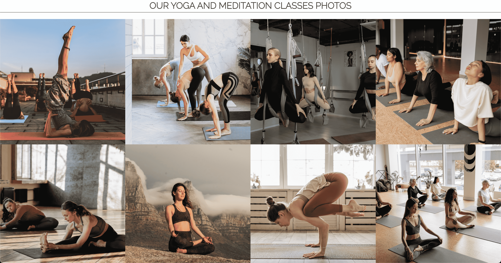

# SATVIK LIFE
Live life with nature. Satvik life helps you solve all your life problems through yoga and meditation. Here we can give a new twist to your life, which will infuse new energy into a healthy life.

Yoga is an ancient spiritual practice from India that uses breath control, physical exercise, and meditative postures. The practice of yoga uses “asanas” or various physical poses to achieve a divine connection with the universe. In fact, the word yoga means “union” in Sanskrit. Some people refer to yoga as moving meditation, where you calm your mind and create awareness through doing the poses.

Meditation or “dhyana” is also a part of yoga. Like the physical practice of yoga, dhyana also forms a profound connection with the universe by doing mental exercises to bring you to a higher state of consciousness. This connection happens in savasana when you are in a meditative, peaceful state.

Satvik life site live here [CLICK HERE..](https://kamal-kohli.github.io/Project-1-Satvik-/)

## INDEX
+ [SITE FEATURES](#site-features "SITE FEATURES")
  + [SITE FEATURES](#site-features "SITE FEATURES")
  + [Site Goal](#site-goal "Site Goal")
  + [Audience](#audience "Audience")
  + [Communication](#communication "Communication")
  + [Current User Goals](#current-user-goals "Current User Goals")
+ [FEATURES](#features "FEATURES")
  + [Navigation Bar](#navigation-bar "Navigation Bar")
  + [Our Slogan](#our-slogan "Our Slogan")
  + [Our Services](#our-services "Our Services")
  + [Footer](#footer "Footer")
  + [About us](#about-us "About us")
  + [Gallery](#gallery "Gallery")
  + [Location](#location "Location")
  + [Sign Up](#sign-up "Sign Up")
  + [Colour Scheme](#colour-scheme "Colour Scheme")
  + [Typography](#typography "Typography")
+ [FUTURE FEATURES](#future-features "FUTURE FEATURES")
+ [Testing](#testing "Testing")
  + [Validator Testing](#validator-testing "Validator Testing")
+ [TECHNOLOGIES USED](#technologies-used "TECHNOLOGIES USED")
  + [Programme](#programme "Programme")
  + [Editor](#editor "Editor")
  + [Frameworks, Libraries & Programs Used](#frameworks-libraries-programs-used "Frameworks, Libraries & Programs Used")
+ [DEPLOYMENT](#deployment "DEPLOYMENT")
+ [CREDITS](#credits "CREDITS")
  + [Content](#content "Content")
  + [Media](#media "Media")

## SITE FEATURES

### Site Purpose:
- To reach out to those people with whom we have not yet been touched and who are far from our reach. Through the Site, we can deliver our services to anyone anywhere in the world.

### Site Goal:
- Our goal is to remove mental and physical problems by making our service accessible to as many people as possible. So that every person in the world feels the communication of a new energy in his life.

### Audience:
- People who give importance to their body nad mental health, who want to get rid of mental problem or physical problem. People in search of peace. Our target are children, men & women with any age.

### Communication:
- This site has been built on the principle of easy to understand. Its bold  and easy typography and design make it easy to navigate, with buttons to jump from one information to another, giving you all you need with just one click. With the help of photographs, the consumer can better understand all the activities of our programs.

### Current User Goals:
- Provide our services to everyone everywhere online or onsite.

## FEATURES

### Navigation Bar: 
- This is included across all three pages, and provides people with an easy reference to navigate between the 'Home', 'About' & 'Sign Up' pages.

[Go to site](https://8000-kamalkohli-project1satv-tea8wr192qb.ws-eu93.gitpod.io/index.html)

### Our Slogan:
- The slogan given by us is sufficient to tell that for whom and for whom the aim and policy of our organization is. 

### Our Services:
- The services provided by us are mentioned on the main page, as soon as the user comes to the site, he will understand which service he has to choose. If he wants, he can choose any one, or he can enjoy all the services. 

### Footer:
- You can connect with us via social media in the footer below. So that you can easily get the information about all the programs organized by us and in the future.

### About us:
- On the main page, we have given some information about ourselves, so that in the very first interaction people get some information about us. The rest of the information has been made available on our About us page.

[Go to About us](https://8000-kamalkohli-project1satv-tea8wr192qb.ws-eu93.gitpod.io/about.html)

### Gallery:
- The images provided give an idea to the user, how and for which services they can connect with us for our services. All images provided on the site from free sources, Credit links mention below into credit sections.

### Location: 
- Full width size and sufficient height map provided on the site for easy to located our center. User easily can track your location by google map direction so everyone can reach us easily.

### Sign Up: 
- Once again I have kept the design simplistic, repeating the big bold banner in background of sign up form. There is not a lot of content on the page, rather just a form so that user can easily become member with us. Here user have to make an account with some neccessory required informations.

[Go to Sign Up](https://8000-kamalkohli-project1satv-tea8wr192qb.ws-eu93.gitpod.io/signup.html)

### Colour theme:
Special care has been taken of the colors here, so that the user can easily use the dark and light modes without straining the eyes. Its gray and light beige color has been chosen to be soothing to your eyes.

### Typography:
To make it easier for the user to understand, only two fonts have been used here for writing, "Righteous" for main headings and "Raleway" for paragraphs. Which is available on Google Font's free source, we have given its details in the credit given below. In general, this font makes it easy for you to read the information, so that you can get the complete details of the information given to you.

[Font Righteous](https://fonts.google.com/share?selection.family=Righteous)-
[Font Raleway](https://fonts.google.com/share?selection.family=Raleway)

## FUTURE FEATURES:
 - Service Pages with Pricing
 - Booking slots
 - Online classes portal
 - Personal Trainer at Home
 - Vegetarian food clases and recipes
 - Product Shopping page
 - Online Payment
 - Gallery with more photos.
 - Chat Bot

### Validator Testing:
- HTML files pass through the [W3C validator](https://validator.w3.org/) with no issues found.

- CSS files pass through the [Jigsaw validator](https://jigsaw.w3.org/css-validator/) with no issues found.

- page has an excellent Accessibility rating in Lighthouse

- Tested the site opens in Opera, Chrome & Safari without issues.

## TECHNOLOGIES USED
### Programme
- HTML5
- CSS3

### Editor
- Github
- Gitpod

### Frameworks, Libraries & Programs Used
- Google Fonts - for the font families: Righteous & Raleway. San-serif was used as a default font.
- Font Awesome - to add icons to the social links in the footer element.
- GitPod - to creat my html files & styling sheet before pushing the project to Github.
- GitHub - to store my repository for submission.
- Am I Responsive? - to ensure the project looked good across all devices.
- Favicon - to provide the code & image for the icon in the tab bar.

## DEPLOYMENT
The site was deployed to GitHub pages. The steps to deploy are as follows:
- In the GitHub repository, navigate to the Settings tab
- From the source section drop-down menu, select the Master Branch
- Once the master branch has been selected, the page will be automatically refreshed with a detailed ribbon display to indicate the successful deployment.
- The live link can be found [HERE...](https://kamal-kohli.github.io/Project-1-Satvik-/)

## CREDITS

### Content
As my knowledge of implementation is limited at this point in my learning, the initial set up & style was set loosely on the 'Love Running' & 'Coffee Shop' walk-through project. From there, I took inspiration for the design of the navigation bar, along with the display of the social links in the footer element.

The styling of the form element in 'Love Running' & 'Coffee Shop' was used as a starting point for my form to help remember all categories that needed to be addressed.

-I took some style referance from 'w3schools' online free source for Navigation bar and footer backgroung color.
[Referance](https://www.w3schools.com/howto/howto_js_topnav_responsive.asp)

-For [Image side by side](https://www.w3schools.com/howto/howto_js_topnav_responsive.asp) also referance taken from 'w3schools' for the landing page 

Some support was provided by my fellow student through our 'SLACK community'. They were also immeasurably helpful in explaining positioning containers in a way that I was able to grasp. I also got suggestion for device layout & how to write me readme file in Gitpod

### Media
- Hero image is called ["Wommen perfoming Yoga"](https://www.pexels.com/photo/2-women-sitting-on-galaxy-design-yoga-mat-3822226/) by Elina Fairytale

The following images and there links for HOME PAGE:
- [woman performing yoga](https://www.pexels.com/photo/woman-in-scorpion-pose-3822142/)
- [man doing meditation](https://www.pexels.com/photo/a-man-in-white-thobe-meditating-on-the-mountain-top-4340795/)
- [Healthy food](https://www.pexels.com/photo/flat-lay-photography-of-vegetable-salad-on-plate-1640777/)

The following images and there links for ABOUT US PAGE:
- [Upside down yoga class](https://www.pexels.com/photo/woman-in-scorpion-pose-3822142/)
- [Straching with autism girl](https://www.pexels.com/photo/photo-of-women-stretching-together-4056726/)
- [Thee female students and yoga instructor](https://www.pexels.com/photo/women-doing-yoga-3822668/)
- [Woman doing mediation on the mountain](https://www.pexels.com/photo/woman-in-black-sports-bra-and-black-pants-sitting-on-rock-5184327/)
- [A group performing rope yoga](https://www.pexels.com/photo/group-of-women-doing-yoga-swing-6582869/)
- [Woman doing peacock pose in yoga](https://www.pexels.com/photo/a-woman-in-brown-leggings-balancing-her-body-on-a-yoga-mat-4534867/)
- [A group yoga practice](https://www.pexels.com/photo/people-doing-yoga-in-the-studio-8436589/)
- [A group meditation](https://www.pexels.com/photo/group-of-women-doing-yoga-exercise-8436719/)

Fevicon:
- [Yoga icon](https://www.flaticon.com/free-icon/yoga-posture_55316)

  